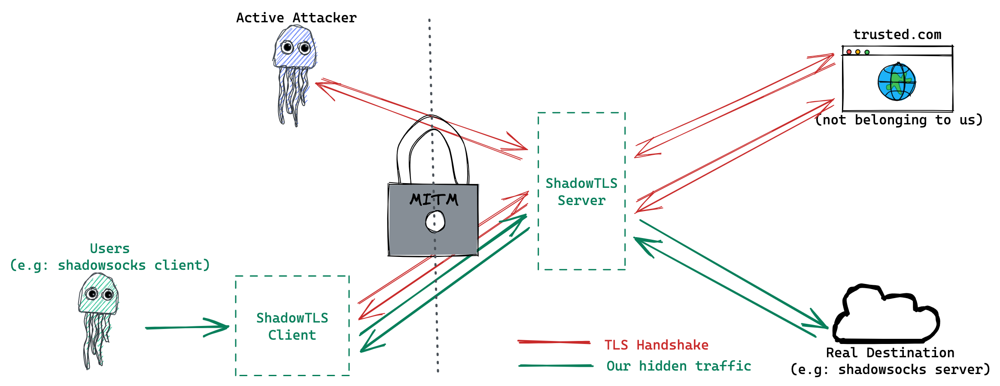

# Protocol

There are two versions of protocol.

The first version is a simple protocol which can only expose real tls handshaking to the man-in-the-middle, but can not defend against active detection, also the traffic after tls handshake is easy to distinguish.

The second version is a more complex one, but it can defend against active detection, and the traffic after tls handshake is hard to distinguish. If attackers access the server with browser, it will work like real web servers.

## V1
In this version, we just want to expose the tls handshaking to the man-in-the-middle, with someone else's certificates.

The man-in-the-middle will see traffics with valid and trusted certificates. Under the assumption that the man-in-the-middle will not perform any active detection, or analysis traffic after tls handshaking finished, this version can be used to defend against:
1. Blocking based on traffic characteristics: We looks like normal TLS traffic.
2. Blocking based on SNI: We use trusted certificates, so the SNI will be valid.

The latest V1 implementation is [v0.1.4](https://github.com/ihciah/shadow-tls/releases/tag/v0.1.4).

### Client
Clients connect server and do tls handshaking. After the handshaking, all client traffic will be sent to server without modification(including encrypting and data packing).

1. Do handshaking with example.trusted-server.domain.
2. Relay traffic without modification.

However, real traffic after tls handshaking is packet with application data protocol. So the traffic is easy to distinguish.

Now the traffic looks like a tls connection with trusted servers(since we can use trusted domains and certificates), but in fact its not a http service. There are far fewer servers using TLS but not http.

### Server
Servers relay data between client and 2 backends. One backend is tls handshaking server which provide valid certificates and not belonging to us. The other backend is our real server. After the handshaking finished, server will relay traffic between client and real server.

1. Accept connections.
2. Relay traffic between client and tls handshaking server(like example.trusted-server.domain:443). Also it will watch the traffic to see if the handshaking finishes.
3. Relay traffic between client and our real server after handshaking finishes.

Since we need to sense when the handshaking finishes, we can only use TLS1.2 for this version.

## V2
This version is designed to solve the issues about traffic analysis and active detection. Also, it makes tls1.3 available.

### Client
Clients connect server and do tls handshaking. After the handshaking:
1. All data will be packed within tls application data.
2. A 8-byte hmac is inserted in the front of the first application data packet.

The hmac is calculated with all of the data that server sent, which can be used as a challenge. The hmac can be treated as a response to the challenge, used to identify.

### Server
Servers relay data between client and 2 backends like V1. The different is: We do not watch the traffic to see if the handshaking finishes. Instead, we use the hmac. So its easier for us to parse the traffic and switch backends. Also, TLS1.3 or other versions are supported.

1. Accept connections.
2. Relay traffic between client and tls handshaking server(like example.trusted-server.domain:443). All data server sent will be used to calculate hmac. If some application data packet that client sent has valid hmac in its front, we will switch the traffic to our real server.
3. If not switched, the traffic will be relayed to tls handshaking server. Users with browser accessing the server will be able to access the http service on handshaking server. For efficiency, we can only proform hmac checking for the first N packets.
